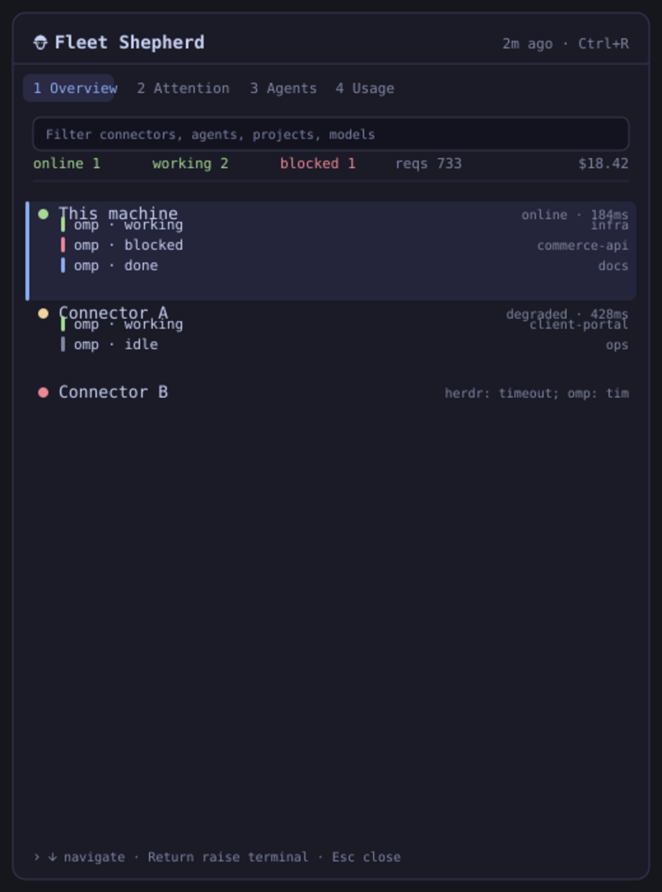

# Fleet Shepherd for Omarchy

One read-only operations panel for Herdr agents and OMP usage across a local and SSH connector fleet.

Fleet Shepherd answers three questions from the bar: are all connectors healthy, does any agent need attention, and what is the fleet’s aggregate OMP usage?



_The preview uses synthetic connector, agent, project, usage and error data._

> Status: v0.1.1 local beta. Read-only fleet snapshots are implemented and live-tested; remote mutation is intentionally not implemented.

## Features

- Local connector plus optional SSH connectors
- Herdr working/blocked/done/idle agent state by connector
- Workspace, project, cwd, and current activity
- OMP requests, cost, tokens, cache/error summaries and top models
- Partial-failure and stale/offline states without discarding the last valid snapshot
- Shared locked runtime cache keeps bar and panel on the same exact snapshot
- Live cross-fleet filter and keyboard navigation
- Strict byte/item/string/concurrency/time bounds
- No network listener, database, raw-session scraping, credentials, or elevated service

## Architecture

The QML plugin starts one bundled Python helper. That helper invokes only fixed commands—`herdr api snapshot` and `omp stats --json`—locally or through a fixed SSH argv. See [DESIGN.md](docs/DESIGN.md) and [REQUIREMENTS.md](docs/REQUIREMENTS.md).

```text
Omarchy panel → fleet-snapshot helper → local / SSH connectors
                                   ↘ bounded normalized JSON
```

## Requirements

- Omarchy Quattro / Quickshell
- Python 3.11+ (stdlib only)
- Herdr and/or OMP on each participating connector
- For remote connectors: noninteractive SSH aliases with verified host keys

The plugin does not install, configure, authenticate, or manage Herdr, OMP, SSH, or Tailscale.

## Configuration

Copy the example and edit connector aliases:

```bash
mkdir -p ~/.config/fleet-shepherd
cp connectors.example.json ~/.config/fleet-shepherd/connectors.json
chmod 600 ~/.config/fleet-shepherd/connectors.json
```

```json
{
  "schemaVersion": 1,
  "connectors": [
    { "id": "local", "label": "This machine", "mode": "local" },
    { "id": "connector-a", "label": "Connector A", "mode": "ssh", "target": "connector-a" }
  ]
}
```

`target` is an OpenSSH Host alias from `~/.ssh/config`. Put username, port, identity, proxy and host-key policy in OpenSSH—not this JSON. Unknown or changed host keys fail closed.

## Keyboard

- Start typing: filter connectors, agents, projects and models
- `Up` / `Down`: move connector selection
- `1`–`4`: Overview / Attention / Agents / Usage
- `Ctrl+R`: refresh
- `Esc`: clear filter, then close

## Install

Install directly:

```bash
omarchy plugin add https://github.com/joshuaswarren/omarchy-fleet-shepherd.git --enable
```

## Remove

```bash
omarchy plugin remove io.github.joshuaswarren.fleet-shepherd
```

Optional config cleanup:

```bash
rm -rf ~/.config/fleet-shepherd
```

## Privacy and security

Fleet Shepherd renders potentially sensitive project paths and terminal titles locally. It does not persist snapshots, transmit telemetry, or read raw OMP sessions. Connector configuration is read via a bounded no-follow, nonblocking descriptor. SSH is BatchMode and StrictHostKeyChecking=yes. Every subprocess and response has a hard deadline and byte ceiling.

## Development

```bash
python3 -m unittest discover -s tests -v
node --test tests/*.test.mjs
qmllint -I /usr/share/omarchy/shell BarWidget.qml Panel.qml
omarchy plugin validate .
```

## License

MIT — see [LICENSE](LICENSE).
